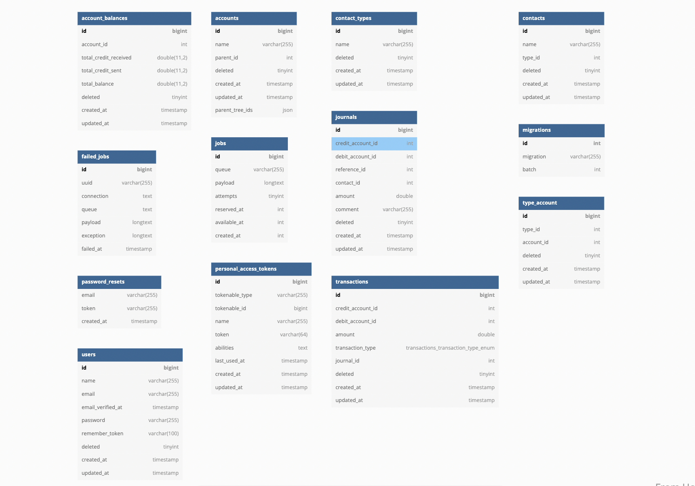

## About The Project

This project mainly foucing on how to implement a double entery system.
**Double Entery System** is a method of bookkeeping that relies on a two-sided accounting entry to maintain financial information

## API Structure

This API contains multiple models including:

- **Account**: In this model you can add upadate multiple accounts, with there sub accounts.

- **User**: It containes the users of our system.

- **Transcation**: In this model you can **create transaction** between two accounts, you can **revert a transaction**, also our **contacts can make transaction** as will to other accounts.

- **Auth**: Handling authentication of our API.

- **Contact**: The users or you can call it the stakeholders where they can create transaction from an account to antoher.

- **Contact Type**: Each Contact has it's on type, so through this table we save types of our contacts. ex(stakeholders,FinanceTeam,investors)

## DATABASE Structure

